# 7. Core Workflows

## 7.1 Deployment Workflow

**🚀 Primary flow for creating a new AI stack**

```mermaid
sequenceDiagram
    autonumber
    participant U as 👤 User
    participant CLI as 🖥️ CLI
    participant UI as 🎨 Rich UI
    participant O as ⚙️ Orchestrator
    participant VPC as 🌐 VPC Service
    participant EFS as 💾 EFS Service
    participant SG as 🛡️ SG Service
    participant EC2 as 🖥️ EC2 Service
    participant SSM as 📋 SSM Service
    participant S as 💾 State Manager

    U->>CLI: geusemaker deploy my-stack --tier dev
    CLI->>UI: Show MAIN_BANNER
    UI-->>U: 🎉 GeuseMaker 2000 banner

    CLI->>O: deploy(config)
    O->>S: Check existing stack
    alt Stack exists
        O-->>CLI: ❌ Stack already exists
        CLI-->>U: Error: Use different name
    end

    rect rgb(200, 230, 255)
        Note over O,VPC: Stage 1: VPC Discovery
        O->>UI: show_stage("vpc_discovery")
        O->>VPC: discover_or_create()
        VPC-->>O: vpc_id, subnet_ids
        O->>UI: ✅ VPC: vpc-xxx
    end

    rect rgb(200, 255, 200)
        Note over O,EFS: Stage 2: EFS Creation (MANDATORY)
        O->>UI: show_stage("efs_creation")
        O->>EFS: create(stack_name)
        EFS-->>O: efs_id
        O->>EFS: create_mount_target(subnet_id)
        EFS-->>O: mount_target_id
        O->>EFS: wait_for_mount()
        O->>UI: ✅ EFS: fs-xxx
    end

    rect rgb(255, 230, 200)
        Note over O,SG: Stage 3: Security Group
        O->>UI: show_stage("security_group")
        O->>SG: create_ai_stack_sg()
        SG-->>O: sg_id
        O->>UI: ✅ Security Group: sg-xxx
    end

    rect rgb(255, 200, 200)
        Note over O,EC2: Stage 4: EC2 Launch
        O->>UI: show_stage("ec2_launch")
        O->>EC2: launch_spot(user_data)
        EC2-->>O: instance_id, public_ip
        O->>EC2: wait_until_running()
        O->>UI: ✅ Instance: i-xxx (1.2.3.4)
    end

    rect rgb(230, 200, 255)
        Note over O,SSM: Stage 5: Docker Startup
        O->>UI: show_stage("docker_startup")
        O->>SSM: stream_docker_logs(instance_id)
        loop Log Streaming
            SSM-->>UI: 🐳 [n8n] Starting...
            SSM-->>UI: 🤖 [ollama] Loading model...
            SSM-->>UI: 🧠 [qdrant] Ready on :6333
        end
    end

    rect rgb(200, 255, 230)
        Note over O,EC2: Stage 6: Health Check
        O->>UI: show_stage("health_check")
        O->>EC2: check_all_services(public_ip)
        EC2-->>O: [🟢 n8n, 🟢 ollama, 🟢 qdrant, 🟢 crawl4ai, 🟢 postgres]
        O->>UI: ✅ All 5 services healthy
    end

    O->>S: save(deployment_state)
    O->>UI: show_deployment_success()
    UI-->>U: 🎉 SUCCESS! n8n at http://1.2.3.4:5678
```



## 7.2 Interactive Deployment Flow

**🔍 User-guided resource discovery and configuration**

```python
async def run_interactive_deployment(console: Console) -> DeploymentConfig:
    """Interactive deployment with progressive disclosure."""
    ui = DeploymentUI(console)

    # Step 1: Stack naming
    console.print(f"\n{EMOJI['rocket']} [bold]New Deployment[/]\n")
    stack_name = Prompt.ask(
        f"{EMOJI['star']} Stack name",
        default=f"ai-stack-{datetime.now().strftime('%Y%m%d')}"
    )

    # Step 2: Tier selection with visual descriptions
    console.print(f"\n{EMOJI['config']} [bold]Select Deployment Tier[/]\n")
    tier_table = Table(show_header=True, border_style="cyan")
    tier_table.add_column("Tier", style="bold")
    tier_table.add_column("Features")
    tier_table.add_column("Best For")
    tier_table.add_column("Est. Cost")
    tier_table.add_row("🟢 dev", "Spot EC2 + EFS", "Development, testing", "$14/mo")
    tier_table.add_row("🟡 automation", "+ ALB + Health Checks", "Production workloads", "$35/mo")
    tier_table.add_row("🔴 gpu", "+ CloudFront CDN", "GPU inference at scale", "$150+/mo")
    console.print(tier_table)

    tier = Prompt.ask(
        f"{EMOJI['search']} Select tier",
        choices=["dev", "automation", "gpu"],
        default="dev"
    )

    # Step 3: VPC Discovery
    console.print(f"\n{EMOJI['network']} [bold]VPC Configuration[/]\n")
    vpcs = await vpc_service.discover_existing()

    if vpcs:
        vpc_choices = {f"{v['id']} ({v['cidr']})": v['id'] for v in vpcs}
        vpc_choices["[Create New VPC]"] = None

        vpc_selection = Prompt.ask(
            f"{EMOJI['search']} Select VPC",
            choices=list(vpc_choices.keys()),
            default=list(vpc_choices.keys())[0]
        )
        vpc_id = vpc_choices[vpc_selection]
    else:
        console.print(f"   {EMOJI['info']} No existing VPCs found, will create new")
        vpc_id = None

    # Step 4: Instance type (with cost preview)
    console.print(f"\n{EMOJI['server']} [bold]Instance Configuration[/]\n")
    use_spot = Confirm.ask(
        f"{EMOJI['money']} Use spot instances for ~70% savings?",
        default=True
    )

    # Step 5: Confirmation
    console.print(f"\n{EMOJI['info']} [bold]Deployment Summary[/]\n")
    summary = Table(show_header=False, border_style="green")
    summary.add_row("Stack Name", f"[cyan]{stack_name}[/]")
    summary.add_row("Tier", f"[yellow]{tier}[/]")
    summary.add_row("VPC", vpc_id or "[dim]Auto-create[/]")
    summary.add_row("Instance", "Spot" if use_spot else "On-Demand")
    console.print(summary)

    if Confirm.ask(f"\n{EMOJI['rocket']} Proceed with deployment?", default=True):
        return DeploymentConfig(
            stack_name=stack_name,
            tier=tier,
            vpc_id=vpc_id,
            use_spot=use_spot,
        )
    else:
        raise click.Abort()
```

## 7.3 Destruction Workflow

**💥 Safe stack teardown with EFS preservation**

```mermaid
sequenceDiagram
    autonumber
    participant U as 👤 User
    participant CLI as 🖥️ CLI
    participant UI as 🎨 Rich UI
    participant O as ⚙️ Orchestrator
    participant S as 💾 State Manager
    participant EC2 as 🖥️ EC2 Service
    participant ALB as ⚖️ ALB Service
    participant CF as 🌍 CloudFront Service
    participant SG as 🛡️ SG Service

    U->>CLI: geusemaker destroy my-stack
    CLI->>S: load(stack_name)
    S-->>CLI: DeploymentState

    CLI->>UI: show_stage("destroy")
    UI-->>U: ⚠️ WARNING: Destroying Stack

    CLI->>UI: show_destroy_warning()
    UI-->>U: Resources to delete...
    UI-->>U: 💾 EFS PRESERVED (manual delete)

    U->>CLI: Confirm: Yes

    rect rgb(255, 200, 200)
        Note over O: Phase 1: Terminate Compute
        O->>EC2: terminate_instance(instance_id)
        EC2-->>O: ✅ Terminated
        O->>UI: 🗑️ EC2 Instance terminated
    end

    alt Has ALB (Tier 2+)
        rect rgb(255, 220, 200)
            Note over O,ALB: Phase 2: Remove Load Balancer
            O->>ALB: delete_listener()
            O->>ALB: delete_target_group()
            O->>ALB: delete_load_balancer()
            ALB-->>O: ✅ ALB deleted
            O->>UI: 🗑️ ALB removed
        end
    end

    alt Has CloudFront (Tier 3)
        rect rgb(255, 240, 200)
            Note over O,CF: Phase 3: Remove CDN
            O->>CF: disable_distribution()
            O->>CF: wait_for_deployed()
            O->>CF: delete_distribution()
            CF-->>O: ✅ CloudFront deleted
            O->>UI: 🗑️ CloudFront removed
        end
    end

    rect rgb(200, 200, 255)
        Note over O,SG: Phase 4: Cleanup Security
        O->>SG: delete_security_group(sg_id)
        SG-->>O: ✅ SG deleted
        O->>UI: 🗑️ Security Group removed
    end

    O->>S: delete(stack_name)
    O->>UI: show_destruction_complete()
    UI-->>U: ✅ Stack destroyed
    UI-->>U: 💾 EFS fs-xxx preserved for data recovery
```



## 7.4 Rollback Workflow

**⏪ Auto-recovery from deployment failures**

```mermaid
sequenceDiagram
    autonumber
    participant T as ⏰ Trigger
    participant O as ⚙️ Orchestrator
    participant UI as 🎨 Rich UI
    participant S as 💾 State Manager
    participant EC2 as 🖥️ EC2 Service
    participant EFS as 💾 EFS Service

    Note over T: Triggers: health_check_failed, timeout, spot_interruption, manual

    T->>O: trigger_rollback(reason)
    O->>UI: show_stage("rollback")
    UI-->>O: ⏪ ROLLBACK IN PROGRESS

    O->>S: load(stack_name)
    S-->>O: current_state

    alt Has last_healthy_state
        O->>S: snapshot current → last_healthy_state
    end

    O->>S: update(status="rolling_back")

    rect rgb(255, 200, 200)
        Note over O,EC2: Phase 1: Stop Unhealthy Instance
        O->>EC2: terminate_instance(instance_id)
        EC2-->>O: ✅ Terminated
        O->>UI: ✅ EC2 instance terminated
    end

    rect rgb(200, 255, 200)
        Note over O,EFS: Phase 2: Verify EFS Intact
        O->>EFS: describe_file_system(efs_id)
        EFS-->>O: status: available
        O->>UI: ✅ EFS data intact
    end

    alt Restore Mode (has last_healthy_state)
        rect rgb(200, 200, 255)
            Note over O: Phase 3a: Restore from Snapshot
            O->>EC2: launch_spot(last_healthy_config)
            EC2-->>O: new_instance_id
            O->>EC2: wait_for_healthy()
            O->>S: update(instance_id=new_instance_id)
            O->>UI: ✅ Restored to healthy state
        end
    else Clean Rollback (no snapshot)
        rect rgb(255, 255, 200)
            Note over O: Phase 3b: Clean State
            O->>S: update(status="failed", instance_id=null)
            O->>UI: ⚠️ Stack in failed state
            O->>UI: 💾 EFS preserved, re-deploy when ready
        end
    end

    O->>S: append_rollback_record(trigger, success)
    O->>UI: Rollback complete

    alt Spot Interruption
        UI-->>O: 💡 Consider on-demand for stability
    end
```



## 7.5 Health Monitoring Workflow

**💚 Continuous service health validation**

```python
async def health_monitoring_loop(
    stack_name: str,
    state: DeploymentState,
    config: DeploymentConfig,
) -> None:
    """Continuous health monitoring with auto-rollback."""
    ui = DeploymentUI(Console())
    consecutive_failures = defaultdict(int)
    FAILURE_THRESHOLD = 3

    while True:
        services = await check_all_services(state.public_ip)

        for svc in services:
            if svc.status == "healthy":
                consecutive_failures[svc.service_name] = 0
                ui.console.print(
                    f"{EMOJI['success']} {EMOJI[svc.service_name]} {svc.service_name}: "
                    f"[green]HEALTHY[/] ({svc.response_time_ms}ms)"
                )
            else:
                consecutive_failures[svc.service_name] += 1
                ui.console.print(
                    f"{EMOJI['error']} {EMOJI[svc.service_name]} {svc.service_name}: "
                    f"[red]UNHEALTHY[/] - {svc.error_message}"
                )

                # Check rollback threshold
                if consecutive_failures[svc.service_name] >= FAILURE_THRESHOLD:
                    if config.auto_rollback_on_failure:
                        ui.console.print(
                            f"\n{EMOJI['warning']} [bold red]Auto-rollback triggered![/]\n"
                            f"   Service: {svc.service_name}\n"
                            f"   Failures: {FAILURE_THRESHOLD} consecutive\n"
                        )
                        await trigger_rollback(
                            stack_name,
                            trigger="health_check_failed",
                            details={"service": svc.service_name}
                        )
                        return

        await asyncio.sleep(30)  # Check every 30 seconds
```

### 7.5.1 Alerting Thresholds

**Production alerting configuration for monitoring:**

| Metric | Warning Threshold | Critical Threshold | Action |
|--------|-------------------|-------------------|--------|
| **Service Health** | 1 failure | 3 consecutive failures | Auto-rollback |
| **Response Time** | > 2000ms | > 5000ms | Log warning / Alert |
| **Health Check Interval** | - | 30 seconds | Continuous polling |
| **Rollback Timeout** | - | 15 minutes (configurable) | Abort rollback |

```python